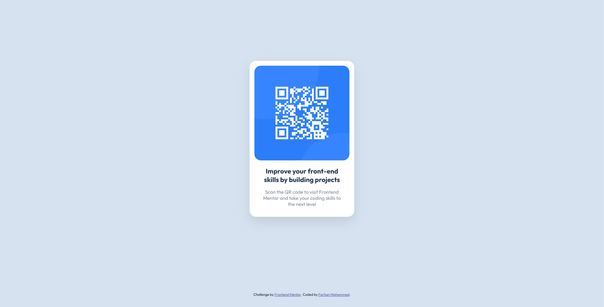

# Frontend Mentor - QR code component solution

This is a solution to the [QR code component challenge on Frontend Mentor](https://www.frontendmentor.io/challenges/qr-code-component-iux_sIO_H).

## Table of contents

- [Overview](#overview)
  - [Screenshot](#screenshot)
  - [Links](#links)
- [My process](#my-process)
  - [Built with](#built-with)
  - [Continued development](#continued-development)
  - [Useful resources](#useful-resources)
- [Author](#author)

## Overview

### Screenshot

### Links

- Solution URL: [Add solution URL here](https://your-solution-url.com)
- Live Site URL: [QR Code Component](https://qr-code-component-indol-tau.vercel.app)

## My process

### Built with

- HTML
- CSS

### Continued development

I will be attempting the solution again by using various frameworks/libraries such as React, Bootstrap, Tailwind, and so on.

### Useful resources

- [CSS-Tricks Flexbox Guide](https://css-tricks.com/snippets/css/a-guide-to-flexbox/) - If you ever need help with understanding CSS Flexbox this is the best resource to go to.

## Author

- Website - [Farhan Mohammed (Still under construction)](https://famohammed.vercel.app)
- Frontend Mentor - [@Nemesis-12](https://www.frontendmentor.io/profile/yourusername)
